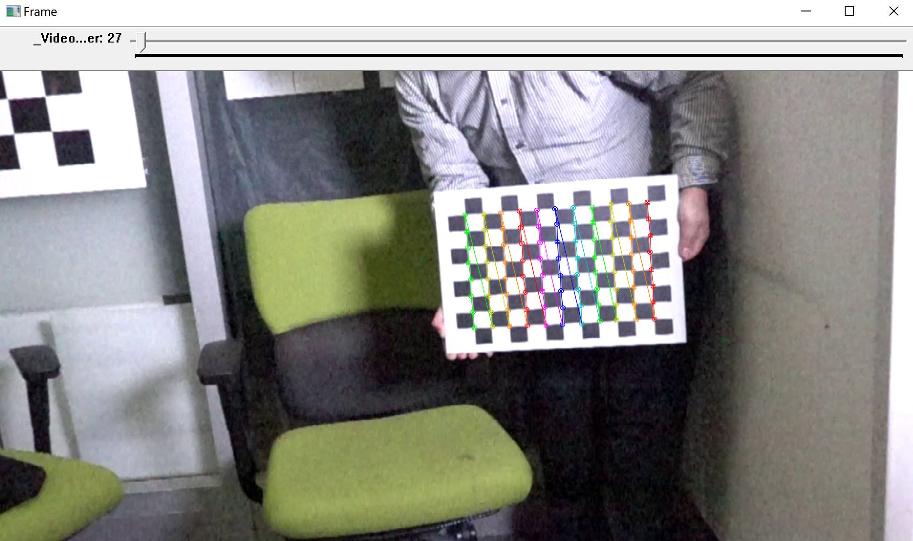

# save_img_from_video
This repo is to save raw image from a video.
You need to install OpenCV

You can press the 'space' bottom to pause or resume the video.
        press the 'left' or 'right' bottom to go to next or previous frame.
        press the 's' bottom to save current raw frame.
        
the code also detect the chessboard, when you run this video.
